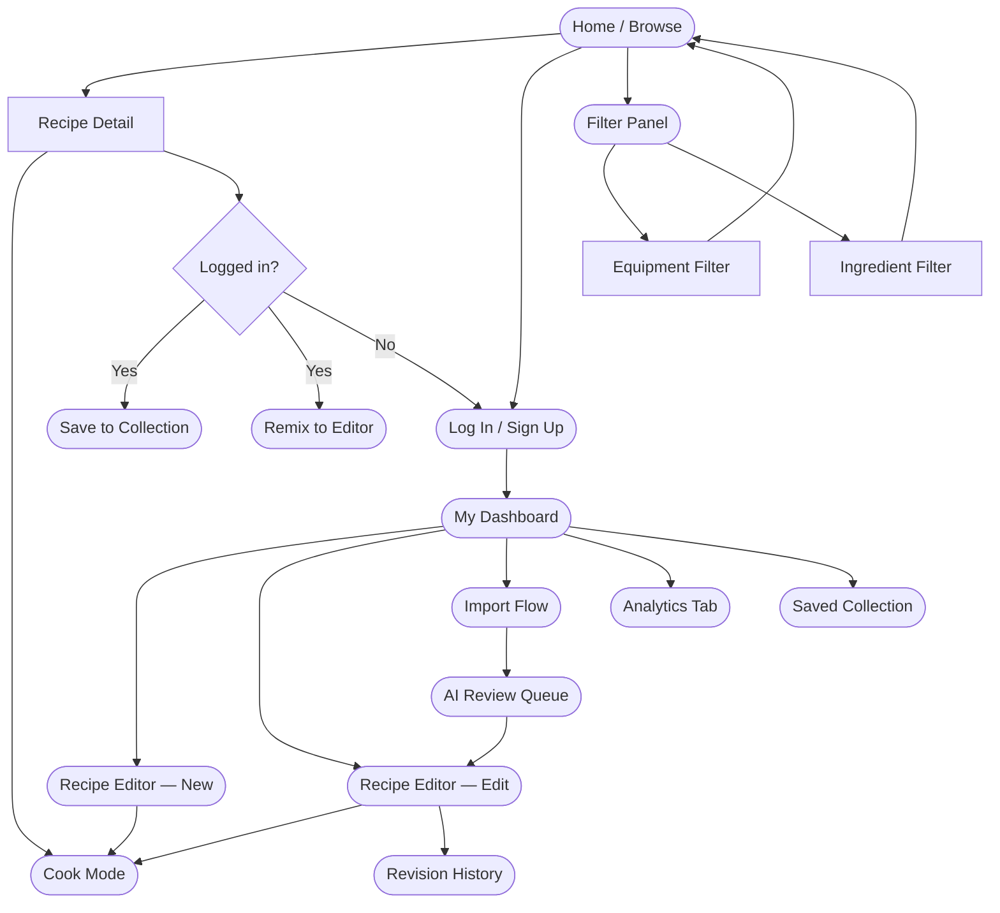
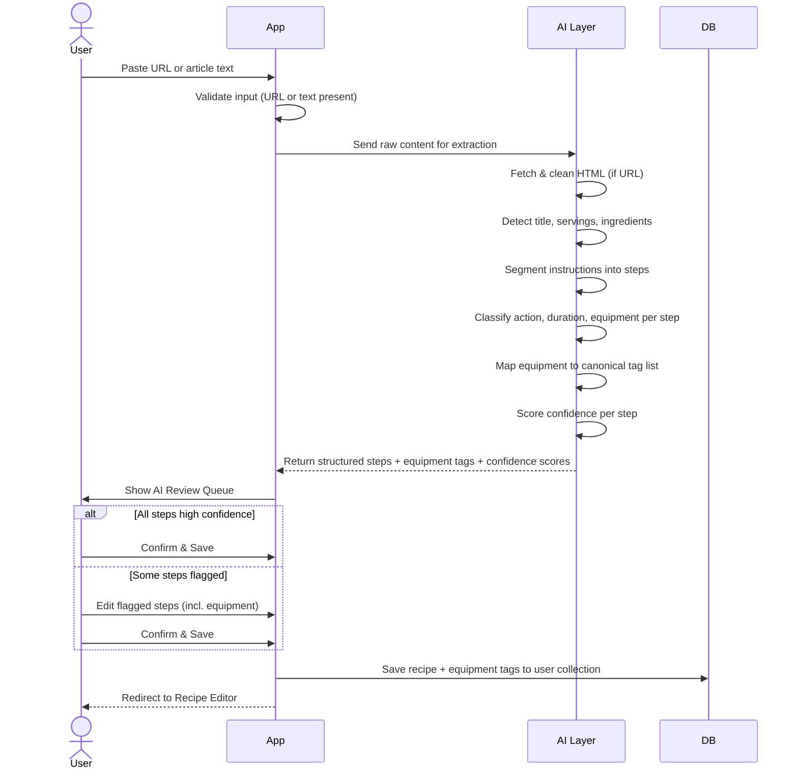

# StepDish — ASCII Wireframes

> **Version 1.1 | May 2026**
> Updated: WF-02 (step editor — added equipment field), WF-05 (filter panel — added equipment + ingredient filters), WF-06 (recipe detail — added equipment list)
> All wireframes are mobile-first (375px). Desktop layouts noted where they differ significantly.

---

## WF-01 — Sign Up / Log In (US-001, US-002)

```
┌─────────────────────────────────┐
│          StepDish  🍽            │
│                                 │
│    ┌─────────────────────────┐  │
│    │  📧  Email              │  │
│    └─────────────────────────┘  │
│    ┌─────────────────────────┐  │
│    │  🔒  Password           │  │
│    └─────────────────────────┘  │
│                                 │
│    ┌─────────────────────────┐  │
│    │     [ Log In ]          │  │
│    └─────────────────────────┘  │
│                                 │
│    ──────── or ────────         │
│                                 │
│    ┌─────────────────────────┐  │
│    │  G   Continue w/ Google │  │
│    └─────────────────────────┘  │
│    ┌─────────────────────────┐  │
│    │  🍎  Continue w/ Apple  │  │
│    └─────────────────────────┘  │
│                                 │
│    Don't have an account?       │
│    [ Sign Up ]  · Forgot pw?    │
└─────────────────────────────────┘
```

**Sign Up variant** — same layout, adds:
```
┌─────────────────────────────────┐
│    ┌─────────────────────────┐  │
│    │  👤  Display Name       │  │
│    └─────────────────────────┘  │
│    ┌─────────────────────────┐  │
│    │  📧  Email              │  │
│    └─────────────────────────┘  │
│    ┌─────────────────────────┐  │
│    │  🔒  Password           │  │
│    └─────────────────────────┘  │
│    ┌─────────────────────────┐  │
│    │  🔒  Confirm Password   │  │
│    └─────────────────────────┘  │
│                                 │
│    ┌─────────────────────────┐  │
│    │     [ Create Account ]  │  │
│    └─────────────────────────┘  │
│                                 │
│  ☑ I agree to Terms of Service  │
└─────────────────────────────────┘
```

---

## WF-02 — Recipe Editor — Create / Edit (US-003, US-004, US-005)

### 2a. Recipe Header Form

```
┌─────────────────────────────────┐
│  ←  New Recipe          [ Save ]│
├─────────────────────────────────┤
│  ┌───────────────────────────┐  │
│  │  Recipe Title             │  │
│  └───────────────────────────┘  │
│                                 │
│  Cuisine        Servings        │
│  ┌────────────┐ ┌────────────┐  │
│  │ Italian  ▾ │ │  2      ▾  │  │
│  └────────────┘ └────────────┘  │
│                                 │
│  Total Est. Time                │
│  ┌───────────────────────────┐  │
│  │  45 min                   │  │
│  └───────────────────────────┘  │
│                                 │
│  Visibility                     │
│  ○ Draft (Private)              │
│  ● Published (Public)           │
│                                 │
│  ─── Equipment Needed ────────  │
│  (auto-compiled from steps)     │
│  🔧 Frying pan  🔧 Knife        │
│  🔧 Pot                         │
│                                 │
│  ─────────── Steps ───────────  │
│                                 │
│  ┌───────────────────────────┐  │
│  │ Step 1            [ ✎ ]  │  │
│  │ Chop 2 onions             │  │
│  │ ⏱ 5 min  🔧 Knife  🔔 — │  │
│  └───────────────────────────┘  │
│  ┌───────────────────────────┐  │
│  │ Step 2            [ ✎ ]  │  │
│  │ Sauté onions in olive oil │  │
│  │ ⏱ 8 min  🔧 Frying pan   │  │
│  │ 🔔 Stir at 4min           │  │
│  └───────────────────────────┘  │
│  ┌───────────────────────────┐  │
│  │ Step 3            [ ✎ ]  │  │
│  │ Add tomatoes & simmer     │  │
│  │ ⏱ 20 min  🔧 Pot         │  │
│  │ 🔔 Check sauce            │  │
│  └───────────────────────────┘  │
│                                 │
│  ┌───────────────────────────┐  │
│  │      + Add Step           │  │
│  └───────────────────────────┘  │
└─────────────────────────────────┘
```

### 2b. Step Edit Drawer (slides up from bottom)

```
┌─────────────────────────────────┐
│  ╔═══════════════════════════╗  │
│  ║  Edit Step 2         [✕]  ║  │
│  ╠═══════════════════════════╣  │
│  ║                           ║  │
│  ║  Action                   ║  │
│  ║  ┌─────────────────────┐  ║  │
│  ║  │  Sauté            ▾ │  ║  │
│  ║  └─────────────────────┘  ║  │
│  ║                           ║  │
│  ║  Ingredients              ║  │
│  ║  ┌─────────────────────┐  ║  │
│  ║  │  + Add ingredient   │  ║  │
│  ║  │  • 2 onions, sliced │  ║  │
│  ║  │  • 2 tbsp olive oil │  ║  │
│  ║  └─────────────────────┘  ║  │
│  ║                           ║  │
│  ║  Duration                 ║  │
│  ║  ┌─────────────────────┐  ║  │
│  ║  │ 8 min               │  ║  │
│  ║  └─────────────────────┘  ║  │
│  ║                           ║  │
│  ║  Equipment  🔧            ║  │
│  ║  ┌─────────────────────┐  ║  │
│  ║  │  Frying pan    [×]  │  ║  │
│  ║  │  + Add equipment... │  ║  │
│  ║  └─────────────────────┘  ║  │
│  ║  Suggestions: wok · pot   ║  │
│  ║  oven · cast iron pan     ║  │
│  ║                           ║  │
│  ║  Reminder                 ║  │
│  ║  ┌─────────────────────┐  ║  │
│  ║  │  Stir at 4 min      │  ║  │
│  ║  └─────────────────────┘  ║  │
│  ║                           ║  │
│  ║  Notes                    ║  │
│  ║  ┌─────────────────────┐  ║  │
│  ║  │  Medium-high heat   │  ║  │
│  ║  └─────────────────────┘  ║  │
│  ║                           ║  │
│  ║  ┌─────────────────────┐  ║  │
│  ║  │    [ Save Step ]    │  ║  │
│  ║  └─────────────────────┘  ║  │
│  ╚═══════════════════════════╝  │
└─────────────────────────────────┘
```

---

## WF-03 — Cook Mode — Timers & Reminders (US-008, US-009, US-010)

### 3a. Cook Mode — Step View

```
┌─────────────────────────────────┐
│  ←  Tomato Pasta     2 / 5 ████ │
├─────────────────────────────────┤
│                                 │
│  Step 2 of 5                    │
│  ┌───────────────────────────┐  │
│  │                           │  │
│  │  🍳  Sauté onions         │  │
│  │                           │  │
│  │  Ingredients:             │  │
│  │  • 2 onions, sliced       │  │
│  │  • 2 tbsp olive oil       │  │
│  │                           │  │
│  │  🔧 Equipment: Frying pan │  │
│  │                           │  │
│  │  🔔 Stir at 4 min         │  │
│  │                           │  │
│  │  📝 Medium-high heat      │  │
│  │                           │  │
│  └───────────────────────────┘  │
│                                 │
│  ┌───────────────────────────┐  │
│  │  ▶  Start Timer  8:00     │  │
│  └───────────────────────────┘  │
│                                 │
│  [ ← Prev Step ]  [ Next Step →]│
└─────────────────────────────────┘
```

### 3b. Cook Mode — Active Timer State

```
┌─────────────────────────────────┐
│  ←  Tomato Pasta     2 / 5 ████ │
├─────────────────────────────────┤
│  ┌───────────────────────────┐  │
│  │  🍳  Sauté onions         │  │
│  │                           │  │
│  │         05:42             │  │
│  │      ████████░░░          │  │
│  │                           │  │
│  │   [ ⏸ Pause ]  [ ✕ Stop ]│  │
│  └───────────────────────────┘  │
│                                 │
│  ── Active Timers ─────────────  │
│  ┌───────────────────────────┐  │
│  │  Step 2  Sauté   05:42 ⏸ │  │
│  │  Step 4  Boil    12:10 ▶  │  │
│  └───────────────────────────┘  │
│                                 │
│  [ ← Prev Step ]  [ Next Step →]│
└─────────────────────────────────┘
```

### 3c. Reminder Alert (overlay)

```
┌─────────────────────────────────┐
│                                 │
│  ╔═══════════════════════════╗  │
│  ║  🔔  Reminder             ║  │
│  ║                           ║  │
│  ║  Step 2 — Sauté onions    ║  │
│  ║                           ║  │
│  ║  "Stir at 4 min"          ║  │
│  ║                           ║  │
│  ║  ┌─────────────────────┐  ║  │
│  ║  │     [ Dismiss ]     │  ║  │
│  ║  └─────────────────────┘  ║  │
│  ╚═══════════════════════════╝  │
│                                 │
└─────────────────────────────────┘
```

---

## WF-04 — Revision History Panel (US-006)

```
┌─────────────────────────────────┐
│  ←  Tomato Pasta   [ History ]  │
├─────────────────────────────────┤
│  ╔═══════════════════════════╗  │
│  ║  Revision History    [✕]  ║  │
│  ╠═══════════════════════════╣  │
│  ║                           ║  │
│  ║  ● Current Version        ║  │
│  ║    Today 10:14am          ║  │
│  ║    Changed step 3 timing  ║  │
│  ║                           ║  │
│  ║  ○ Version 3              ║  │
│  ║    Yesterday 8:02pm       ║  │
│  ║    Added step 4           ║  │
│  ║    [ Preview ] [ Restore ]║  │
│  ║                           ║  │
│  ║  ○ Version 2              ║  │
│  ║    27 May  3:15pm         ║  │
│  ║    Updated ingredients    ║  │
│  ║    [ Preview ] [ Restore ]║  │
│  ║                           ║  │
│  ║  ○ Version 1 (Original)   ║  │
│  ║    25 May  11:30am        ║  │
│  ║    Recipe created         ║  │
│  ║    [ Preview ] [ Restore ]║  │
│  ║                           ║  │
│  ╚═══════════════════════════╝  │
└─────────────────────────────────┘
```

---

## WF-05 — Public Browse + Search + Filter (US-011, US-012, US-013, US-025, US-026)

### 5a. Browse Page

```
┌─────────────────────────────────┐
│  StepDish          [ 👤 Login ] │
├─────────────────────────────────┤
│  ┌───────────────────────────┐  │
│  │ 🔍  Search recipes...     │  │
│  └───────────────────────────┘  │
│                                 │
│  [ All ] [ Quick ] [ Italian ]  │
│  [ Asian ] [ Vegetarian ] [+]   │
│                                 │
│  Active filters:                │
│  [⏱ ≤30min ×] [🔧 Wok ×]      │
│  [🥦 chicken ×] [🥦 garlic ×]  │
│  [ + Add Filter ]               │
│                                 │
│  ─────────── 34 recipes ──────  │
│  (showing full + partial match) │
│                                 │
│  ┌───────────────────────────┐  │
│  │ [      image       ]      │  │
│  │ ✅ Garlic Butter Chicken  │  │
│  │ 🍗 Asian · ⏱ 25 min      │  │
│  │ 🔧 Wok · 4 steps · ★4.6  │  │
│  └───────────────────────────┘  │
│  ┌───────────────────────────┐  │
│  │ [      image       ]      │  │
│  │ 🟡 Chicken Stir Fry       │  │
│  │ Missing: soy sauce        │  │
│  │ 🔧 Wok · ⏱ 20 min · ★4.4 │  │
│  └───────────────────────────┘  │
│                                 │
│       [ Load more recipes ]     │
└─────────────────────────────────┘
```

> Legend: ✅ Full ingredient match  🟡 Partial match (missing items shown)

### 5b. Filter Panel (slides in from right)

```
┌─────────────────────────────────┐
│  ╔═══════════════════════════╗  │
│  ║  Filters             [✕]  ║  │
│  ╠═══════════════════════════╣  │
│  ║                           ║  │
│  ║  Total Time               ║  │
│  ║  ○ Any                    ║  │
│  ║  ○ Under 15 min           ║  │
│  ║  ● Under 30 min           ║  │
│  ║  ○ Under 1 hour           ║  │
│  ║                           ║  │
│  ║  Cuisine                  ║  │
│  ║  ┌─────────────────────┐  ║  │
│  ║  │  Any cuisine       ▾│  ║  │
│  ║  └─────────────────────┘  ║  │
│  ║                           ║  │
│  ║  Difficulty               ║  │
│  ║  ○ Any  ● Easy            ║  │
│  ║  ○ Medium  ○ Hard         ║  │
│  ║                           ║  │
│  ║  Min. Rating              ║  │
│  ║  ★ ★ ★ ★ ☆  (4+)         ║  │
│  ║                           ║  │
│  ║  ─── 🔧 Equipment ──────  ║  │
│  ║  I have these tools:      ║  │
│  ║  ┌─────────────────────┐  ║  │
│  ║  │ Search equipment... │  ║  │
│  ║  └─────────────────────┘  ║  │
│  ║  [Wok ×] [Oven ×]        ║  │
│  ║  [Knife ×]               ║  │
│  ║                           ║  │
│  ║  Common: [ Blender ]      ║  │
│  ║  [ Air Fryer ] [ Grill ]  ║  │
│  ║  [ Stand Mixer ] [ Pot ]  ║  │
│  ║  [ Cast Iron ] [ Wok ]    ║  │
│  ║                           ║  │
│  ║  ─── 🥦 Ingredients ────  ║  │
│  ║  I have these ingredients:║  │
│  ║  ┌─────────────────────┐  ║  │
│  ║  │ Type an ingredient..│  ║  │
│  ║  └─────────────────────┘  ║  │
│  ║  [chicken ×] [garlic ×]  ║  │
│  ║  [soy sauce ×]            ║  │
│  ║                           ║  │
│  ║  Show partial matches     ║  │
│  ║  ● On  ○ Off              ║  │
│  ║                           ║  │
│  ║  ┌─────────────────────┐  ║  │
│  ║  │  [ Apply Filters ]  │  ║  │
│  ║  └─────────────────────┘  ║  │
│  ║  [ Clear All ]            ║  │
│  ╚═══════════════════════════╝  │
└─────────────────────────────────┘
```

---

## WF-06 — Recipe Detail Page (US-014, US-018, US-019)

```
┌─────────────────────────────────┐
│  ←  Browse                      │
├─────────────────────────────────┤
│  [         Hero Image          ]│
│                                 │
│  Tomato Pasta                   │
│  🍝 Italian · ⏱ 35 min · 2 srv │
│  ★ 4.8  (42 reviews)            │
│  by @chef_anna                  │
│                                 │
│  ┌──────────┐  ┌─────────────┐  │
│  │ 🔖 Save  │  │  ↗ Remix    │  │
│  └──────────┘  └─────────────┘  │
│                                 │
│  ─────── Equipment Needed ────  │
│  🔧 Knife & board               │
│  🔧 Frying pan                  │
│  🔧 Pot                         │
│                                 │
│  ─────── Ingredients ─────────  │
│  ✅ 200g spaghetti              │
│  ✅ 3 ripe tomatoes, diced      │
│  🟡 2 cloves garlic, minced     │
│  ✅ 2 tbsp olive oil            │
│  ✅ Salt, pepper, basil         │
│                                 │
│  ✅ = you have it  🟡 = missing │
│                                 │
│  ─────────── Steps ───────────  │
│                                 │
│  ☐  Step 1                      │
│  ┌───────────────────────────┐  │
│  │ 🔪 Chop tomatoes & garlic │  │
│  │ ⏱ 5 min   🔧 Knife, board│  │
│  └───────────────────────────┘  │
│                                 │
│  ☐  Step 2                      │
│  ┌───────────────────────────┐  │
│  │ 🍳 Sauté garlic in oil    │  │
│  │ ⏱ 3 min   🔔 Don't burn  │  │
│  │ 🔧 Frying pan             │  │
│  └───────────────────────────┘  │
│                                 │
│  ☐  Step 3                      │
│  ┌───────────────────────────┐  │
│  │ 🫕 Add tomatoes, simmer   │  │
│  │ ⏱ 15 min  🔔 Stir often  │  │
│  │ 🔧 Pot                    │  │
│  └───────────────────────────┘  │
│                                 │
│  ┌───────────────────────────┐  │
│  │    [ 🍳 Start Cooking ]   │  │
│  └───────────────────────────┘  │
│                                 │
│  ─────────── Ratings ─────────  │
│  ★ ★ ★ ★ ★  4.8 · 42 reviews   │
│  [ ★ Rate this recipe ]         │
│                                 │
│  ─────────── Comments ────────  │
│  @john_k · 2 days ago           │
│  "Added chili flakes, 10/10!"   │
│                                 │
│  @sarah_m · 1 week ago          │
│  "Used canned tomatoes, worked" │
│                                 │
│  ┌───────────────────────────┐  │
│  │  Add a comment...         │  │
│  └───────────────────────────┘  │
└─────────────────────────────────┘
```

---

## WF-07 — Import Flow + AI Review Queue (US-015, US-016, US-017)

### 7a. Import Entry

```
┌─────────────────────────────────┐
│  ←  My Recipes                  │
├─────────────────────────────────┤
│                                 │
│  Import a Recipe                │
│                                 │
│  Paste a recipe URL or article  │
│  text to extract steps with AI. │
│                                 │
│  ┌───────────────────────────┐  │
│  │  https://...              │  │
│  └───────────────────────────┘  │
│                                 │
│           ── or ──              │
│                                 │
│  ┌───────────────────────────┐  │
│  │                           │  │
│  │  Paste article text...    │  │
│  │                           │  │
│  │                           │  │
│  └───────────────────────────┘  │
│                                 │
│  ┌───────────────────────────┐  │
│  │   [ 🤖 Extract Steps ]    │  │
│  └───────────────────────────┘  │
│                                 │
│  ⚠ Imported recipes are saved   │
│  for personal use only.         │
└─────────────────────────────────┘
```

### 7b. AI Extraction — Loading State

```
┌─────────────────────────────────┐
│  ←  Import Recipe               │
├─────────────────────────────────┤
│                                 │
│                                 │
│         🤖  Analysing...        │
│                                 │
│     ████████████░░░░  75%       │
│                                 │
│   ✓ Fetching article            │
│   ✓ Detecting ingredients       │
│   ⟳ Extracting steps...         │
│   ○ Classifying actions         │
│   ○ Detecting equipment         │
│   ○ Estimating durations        │
│                                 │
│                                 │
└─────────────────────────────────┘
```

### 7c. AI Review Queue

```
┌─────────────────────────────────┐
│  ←  Review Extracted Recipe     │
├─────────────────────────────────┤
│  ⚠ 2 steps need your review     │
│                                 │
│  Title                          │
│  ┌───────────────────────────┐  │
│  │  Tomato Pasta Bake        │  │
│  └───────────────────────────┘  │
│                                 │
│  Servings   Cuisine             │
│  ┌────────┐ ┌────────────────┐  │
│  │   4    │ │  Italian      ▾│  │
│  └────────┘ └────────────────┘  │
│                                 │
│  ─── Steps ────────────────────  │
│                                 │
│  ✅  Step 1  (High confidence)  │
│  ┌───────────────────────────┐  │
│  │ Chop tomatoes & garlic    │  │
│  │ ⏱ 5 min  🔧 Knife, board  │  │
│  └───────────────────────────┘  │
│                                 │
│  ⚠   Step 2  (Low confidence)  │
│  ┌───────────────────────────┐  │
│  │ [Cook the base mixture]   │  │
│  │ ⏱ ? min  🔧 ?             │  │
│  │ ← duration & equipment    │  │
│  │    need review            │  │
│  │ [ Edit Step ]             │  │
│  └───────────────────────────┘  │
│                                 │
│  ✅  Step 3  (High confidence)  │
│  ┌───────────────────────────┐  │
│  │ Simmer sauce for 15 min   │  │
│  │ ⏱ 15 min  🔧 Pot          │  │
│  └───────────────────────────┘  │
│                                 │
│  ┌───────────────────────────┐  │
│  │  [ Save to My Recipes ]   │  │
│  └───────────────────────────┘  │
│  Resolve 2 flagged steps first  │
│                                 │
│  [ Discard Import ]             │
└─────────────────────────────────┘
```

---

## WF-08 — My Collection Dashboard (US-018, US-019, US-022)

### My Recipes Tab

```
┌─────────────────────────────────┐
│  StepDish          👤 @anna     │
├─────────────────────────────────┤
│  [ My Recipes ] [ Saved ] [📊] │
├─────────────────────────────────┤
│                                 │
│  My Recipes  (12)               │
│  ┌─────────────────┐  [ + New ] │
│  │ 🔍 Search mine  │            │
│  └─────────────────┘            │
│                                 │
│  ┌───────────────────────────┐  │
│  │ Tomato Pasta       ● Live │  │
│  │ ⏱ 35 min · 5 steps       │  │
│  │ 👁 142 views · 🔖 28 saves│  │
│  │ [ Edit ]  [ Cook ]  [···] │  │
│  └───────────────────────────┘  │
│  ┌───────────────────────────┐  │
│  │ Miso Soup          ○ Draft│  │
│  │ ⏱ 20 min · 3 steps       │  │
│  │ [ Edit ]  [ Cook ]  [···] │  │
│  └───────────────────────────┘  │
│  ┌───────────────────────────┐  │
│  │ Garlic Bread       ● Live │  │
│  │ ⏱ 15 min · 4 steps       │  │
│  │ 👁 89 views · 🔖 11 saves │  │
│  │ [ Edit ]  [ Cook ]  [···] │  │
│  └───────────────────────────┘  │
│                                 │
│  ─── Saved by Me (5) ─────────  │
│                                 │
│  ┌───────────────────────────┐  │
│  │ Pad Thai   by @chef_lee   │  │
│  │ ⏱ 30 min  [ Cook ] [↗]   │  │
│  └───────────────────────────┘  │
└─────────────────────────────────┘
```

### Analytics Tab

```
┌─────────────────────────────────┐
│  StepDish          👤 @anna     │
├─────────────────────────────────┤
│  [ My Recipes ] [ Saved ] [📊] │
├─────────────────────────────────┤
│                                 │
│  Recipe Analytics               │
│  Last 30 days                   │
│                                 │
│  ┌─────────┐ ┌─────────────┐   │
│  │  👁 231 │ │  🔖  39     │   │
│  │  Views  │ │  Saves      │   │
│  └─────────┘ └─────────────┘   │
│  ┌─────────┐ ┌─────────────┐   │
│  │  ↗  8  │ │  ★  4.7     │   │
│  │  Remixes│ │  Avg Rating │   │
│  └─────────┘ └─────────────┘   │
│                                 │
│  Views trend (30d)              │
│  ┌───────────────────────────┐  │
│  │ 20│         ╭──╮          │  │
│  │ 10│    ╭────╯  ╰──╮      │  │
│  │  0│────╯           ╰──   │  │
│  │   └──────────────────     │  │
│  │   May 1          May 29   │  │
│  └───────────────────────────┘  │
│                                 │
│  Top Recipes                    │
│  1. Tomato Pasta  👁 142  ★4.8  │
│  2. Garlic Bread  👁 89   ★4.5  │
│  3. Miso Soup     👁 —   Draft  │
└─────────────────────────────────┘
```

---

## WF-09 — Navigation Structure (All screens)



---

## WF-10 — AI Import Pipeline Flow (US-015, US-016)



---

*Wireframes prepared May 2026. v1.1 updated May 2026 — added equipment field to WF-02, WF-03, WF-06, WF-07; added equipment + ingredient filter sections to WF-05; updated WF-09 navigation. Layouts are indicative — final spacing and visual design defined in the design system.*
